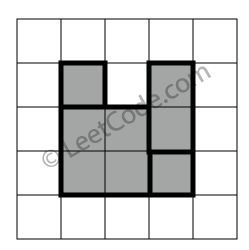

# 391. Perfect Rectangle

Difficulty: Hard

https://leetcode.com/problems/perfect-rectangle/description/

Given N axis-aligned rectangles where N > 0, determine if they all together form an exact cover of a rectangular region.

Each rectangle is represented as a bottom-left point and a top-right point. For example, a unit square is represented as [1,1,2,2]. (coordinate of bottom-left point is (1, 1) and top-right point is (2, 2)).


Example 1:
```
rectangles = [
  [1,1,3,3],
  [3,1,4,2],
  [3,2,4,4],
  [1,3,2,4],
  [2,3,3,4]
]

Return true. All 5 rectangles together form an exact cover of a rectangular region.
```


Example 2:
```
rectangles = [
  [1,1,2,3],
  [1,3,2,4],
  [3,1,4,2],
  [3,2,4,4]
]

Return false. Because there is a gap between the two rectangular regions.
```


Example 3:
```
rectangles = [
  [1,1,3,3],
  [3,1,4,2],
  [1,3,2,4],
  [3,2,4,4]
]

Return false. Because there is a gap in the top center.
```



Example 4:
```
rectangles = [
  [1,1,3,3],
  [3,1,4,2],
  [1,3,2,4],
  [2,2,4,4]
]

Return false. Because two of the rectangles overlap with each other.
```


Companies: Google
