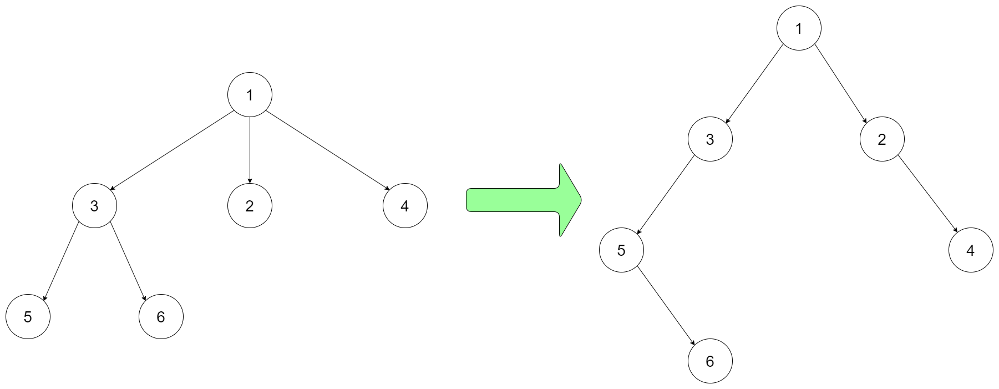

# 431. Encode N-ary Tree to Binary Tree

Difficulty: Hard

https://leetcode.com/problems/encode-n-ary-tree-to-binary-tree/description/

Design an algorithm to encode an N-ary tree into a binary tree and decode the binary tree to get the original N-ary tree. An N-ary tree is a rooted tree in which each node has no more than N children. Similarly, a binary tree is a rooted tree in which each node has no more than 2 children. There is no restriction on how your encode/decode algorithm should work. You just need to ensure that an N-ary tree can be encoded to a binary tree and this binary tree can be decoded to the original N-nary tree structure.

For example, you may encode the following 3-ary tree to a binary tree in this way:

  

Note that the above is just an example which might or might not work. You do not necessarily need to follow this format, so please be creative and come up with different approaches yourself.

**Note:**

1. N is in the range of [1, 1000]
2. Do not use class member/global/static variables to store states. Your encode and decode algorithms should be stateless.

Similar Questions: Serialize and Deserialize N-ary Tree
