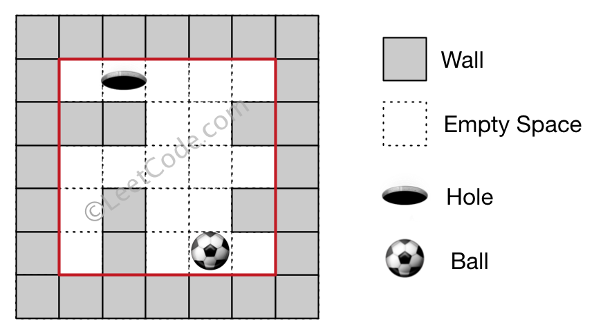
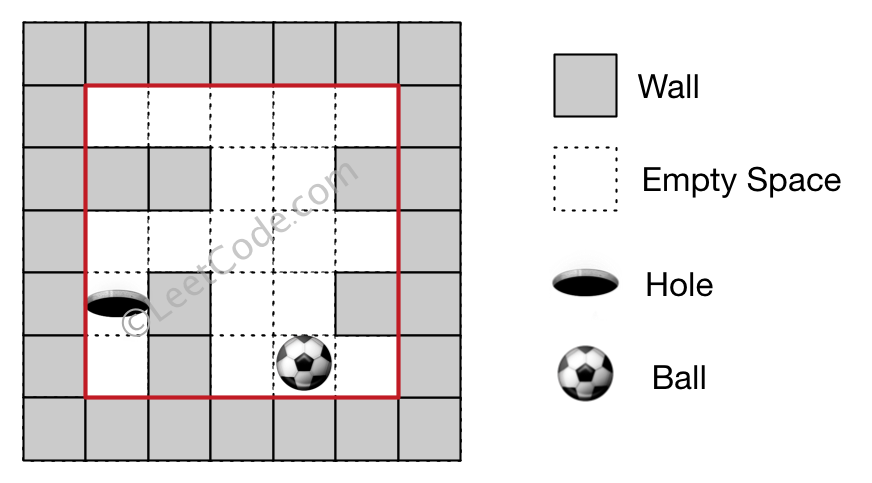

# 499. The Maze III

Difficulty: Hard

https://leetcode.com/problems/the-maze-iii/description/

There is a ball in a maze with empty spaces and walls. The ball can go through empty spaces by rolling up (u), down (d), left (l) or right (r), but it won't stop rolling until hitting a wall. When the ball stops, it could choose the next direction. There is also a hole in this maze. The ball will drop into the hole if it rolls on to the hole.

Given the ball position, the hole position and the maze, find out how the ball could drop into the hole by moving the shortest distance. The distance is defined by the number of empty spaces traveled by the ball from the start position (excluded) to the hole (included). Output the moving directions by using 'u', 'd', 'l' and 'r'. Since there could be several different shortest ways, you should output the lexicographically smallest way. If the ball cannot reach the hole, output "impossible".

The maze is represented by a binary 2D array. 1 means the wall and 0 means the empty space. You may assume that the borders of the maze are all walls. The ball and the hole coordinates are represented by row and column indexes.

Example 1
```
Input 1: a maze represented by a 2D array

0 0 0 0 0
1 1 0 0 1
0 0 0 0 0
0 1 0 0 1
0 1 0 0 0

Input 2: ball coordinate (rowBall, colBall) = (4, 3)
Input 3: hole coordinate (rowHole, colHole) = (0, 1)

Output: "lul"
Explanation: There are two shortest ways for the ball to drop into the hole.
The first way is left -> up -> left, represented by "lul".
The second way is up -> left, represented by 'ul'.
Both ways have shortest distance 6, but the first way is lexicographically smaller because 'l' < 'u'. So the output is "lul".
```


Example 2
```
Input 1: a maze represented by a 2D array

0 0 0 0 0
1 1 0 0 1
0 0 0 0 0
0 1 0 0 1
0 1 0 0 0

Input 2: ball coordinate (rowBall, colBall) = (4, 3)
Input 3: hole coordinate (rowHole, colHole) = (3, 0)
Output: "impossible"
Explanation: The ball cannot reach the hole.
```


Note:
1. There is only one ball and one hole in the maze.
2. Both the ball and hole exist on an empty space, and they will not be at the same position initially.
3. The given maze does not contain border (like the red rectangle in the example pictures), but you could assume the border of the maze are all walls.
4. The maze contains at least 2 empty spaces, and the width and the height of the maze won't exceed 30.

Related Topics: Depth-first Search, Breadth-first Search

Similar Questions: The Maze, The Maze II